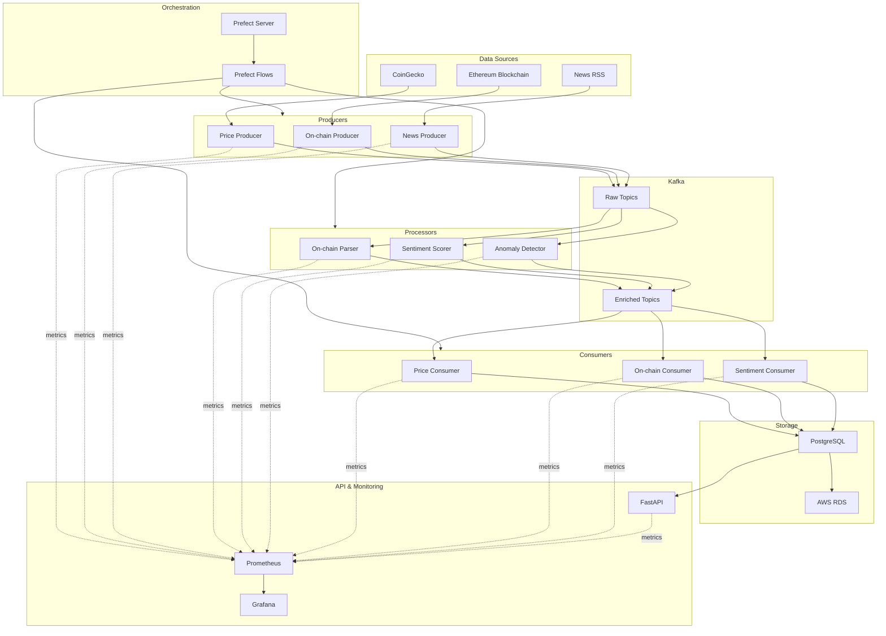

# 🚀 Crypto Intelligence Pipeline

A **production-grade, real-time data pipeline** for **cryptocurrency intelligence** — combining **market data, on-chain analytics, and sentiment analysis** into a unified, scalable system.

Built with **Python, Kafka, Prefect, Docker, FastAPI, Prometheus, Grafana, and Terraform (AWS)**, this project demonstrates **enterprise-scale engineering practices**: orchestration, monitoring, APIs, and cloud provisioning.

---

## 🛠 Tech Stack


---

## 💡 Why This Project Matters

- **Financial Intelligence**: Aggregates real-time crypto market data, blockchain transactions, and news sentiment for smarter trading and risk management.
- **Enterprise-Grade Engineering**: Orchestrated with Prefect, monitored with Prometheus/Grafana, deployed via Docker & Terraform on AWS.
- **Scalable by Design**: Kafka stream processing with exactly-once semantics, supporting large-scale, low-latency workloads.
- **API-Driven Access**: Exposes insights via a REST API (FastAPI), enabling integration with dashboards, trading systems, or analytics tools.

This isn’t a toy project — it’s an **end-to-end data platform** showcasing **cloud, orchestration, and DevOps mastery** alongside **data engineering depth**.

---

## 🌟 Core Features

- **Multi-Source Ingestion**: CoinGecko (prices), Ethereum blockchain (on-chain), RSS feeds (sentiment)
- **Stream Processing**: Apache Kafka with exactly-once semantics
- **Data Enrichment**: Transaction parsing, sentiment analysis, anomaly detection
- **Workflow Orchestration**: Prefect (retry policies, scheduling, observability)
- **Monitoring & Metrics**: Prometheus + Grafana dashboards
- **REST API**: FastAPI endpoints for querying processed insights
- **Cloud-Ready**: AWS RDS via Terraform (infrastructure as code)
- **Containerized Deployment**: Full Docker stack

---

## 🏗️ Crypto Intelligence Pipeline Architecture


---
## 🎬 Demo / Screenshots

### 1️⃣ Prefect Dashboard

Real-time workflow monitoring with retries, schedules, and status updates.

.png)

### 2️⃣ Prometheus targets  Dashboards

.png)

### 3️⃣ FastAPI Docs

Interactive REST API endpoints for querying processed data.

.png)

## 📂 Project Structure

```bash
crypto-intelligence/
│── producers/        # Data ingestion (CoinGecko, Ethereum, News)
│── processors/       # Enrichment (sentiment, parsing, anomaly detection)
│── consumers/        # Data persistence into PostgreSQL
│── api/              # FastAPI REST API
│── flows/            # Prefect workflows
│── infra/            # Terraform & Docker configs
│── docs/             # Documentation & diagrams
│── tests/            # Unit + integration tests
└── README.md
```

---

## 🚀 Quick Start (For Developers)

### ✅ Prerequisites

- Docker & Docker Compose

- Python 3.8+

- Terraform (for AWS)

🛠 Run Locally
```bash
git clone <your-repo-url>
cd crypto-intelligence-pipeline
```

### Configure environment

cp .env.example .env

### Edit with your API keys & DB credentials

### Start infrastructure
```bash
docker compose up --build
```
### 🔍 Access Services

1. Prefect UI → http://localhost:4200

2. Grafana → http://localhost:3000

3. FastAPI Docs → http://localhost:8000/docs
---

## 📈 Roadmap
1. Expand analytics to Layer 2 & cross-chain data

2. Integrate LLM-based sentiment analysis

3. Deploy via Kubernetes + Helm

---

🤝 Contributing
Pull requests and discussions welcome!

---
## 📜 License

This project is licensed under the **MIT License**. See the [LICENSE](LICENSE) file for details.
